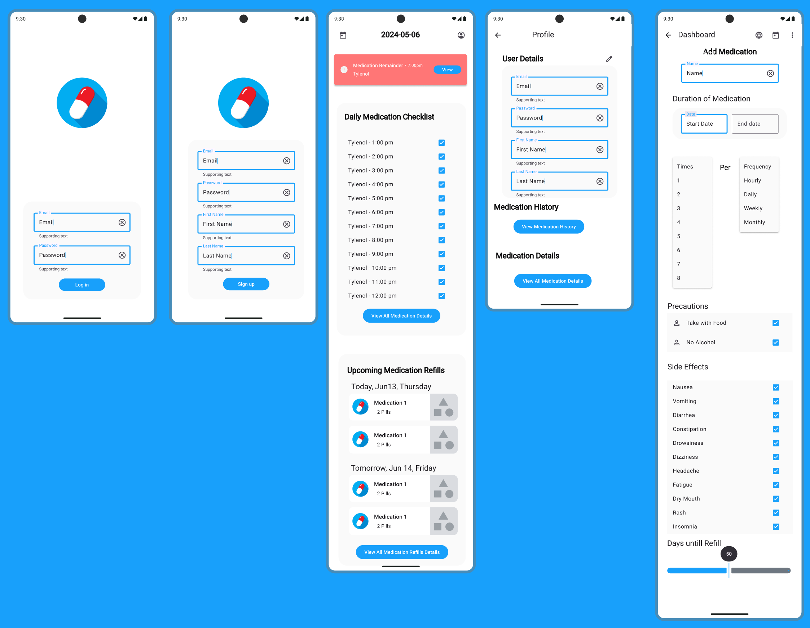

# Dose Diary App

## Overview
Welcome to the GitHub repository of the Dose Diary App. This application is designed to help users manage their medication schedules efficiently. Explore the project documentation and code here!

## Figma Designs
For a comprehensive look at our UI/UX designs, visit our Figma project:
[View Dose Diary on Figma](https://www.figma.com/design/UFtGZyoq8LuZNi6zYhynGP/ECE-452-Project-Design-(Material-Design-Kit)?node-id=11-1833&t=Zm9byqLCW1rT9V63-1)

### Design Examples
Below are some examples of our designs:

(More pages will be added here as they become available.)